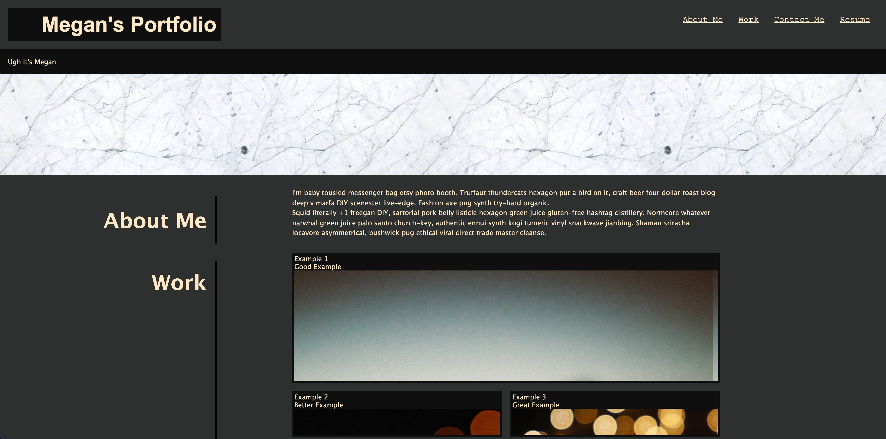

# Professional-Portfolio
site: https://425megs.github.io/Professional-Portfolio/

repo: https://github.com/425megs/Professional-Portfolio

## User Statement
AS AN employer
I WANT to view a potential employee's deployed portfolio of work samples
SO THAT I can review samples of their work and assess whether they're a good candidate for an open position

## Description
I created this site to host the projects I make during my Software Development Coding Bootcamp at the University of Washington. 

Currently, the site is just a template where I will upload projects as I complete them. This site will provide me with a virtual portfolio that can be shared with potential employers to show of examples of my work. 

Creating this site from scratch required me to consider padding and margins as well as learning how to build a grid with differently sized sections. While the layout isn't an exact replica of the example, I'm proud of how close I was able to get in just a few short days. As I continue to work on this site and upload examples, I'm hoping to make the site more scalable and stabilize the sizing for each section. 

